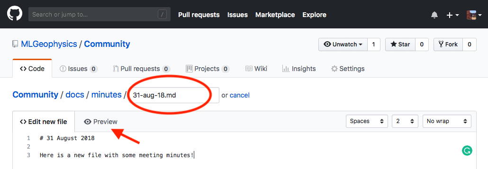
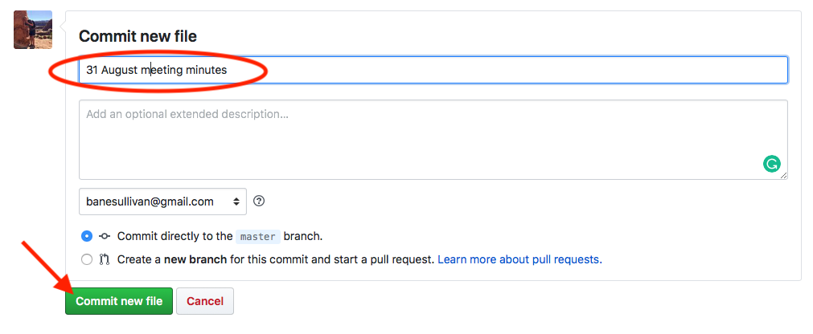

# How to Contribute

Here is a guide on how to contribute your content.

!!! tip "Working in Markdown"
    [**Here**](https://guides.github.com/features/mastering-markdown/) are some tips for writing documentation in Markdown and [**here**](https://squidfunk.github.io/mkdocs-material/) is the guid for `mkdocs-material` markdown specific to this website format.

## On GitHub

We have set up this website to be automatically generated and deployed via Travis-CI
so anyone with write privileges can contribute content and have the website immediately
reflect their contributions!

To get started, go to the [**MLGeophysics/Community**](https://github.com/MLGeophysics/Community)
repository and navigate to the `docs` directory.


From there find the appropriate folder for your contribution and create a new file.
Want to create a new section (a new tab on the menu bar)? Then simply make a new directory in the docs directory.


Add your content in markdown and preview the page before you finish.




Finally commit your changes and wait a few minutes for Travis-CI to deploy the website.




## On Your Own Machine

First, clone the [**MLGeophysics/Community**](https://github.com/MLGeophysics/Community) repository:

```bash
$ git clone https://github.com/MLGeophysics/Community.git

$ cd Community
```


Create a Python virtual environment:

```bash
$ conda create -n mlgp python=3.6

$ conda activate mlgp

(mlgp) $ pip install -r requirements.txt
```

Now lets serve the website on your machine so that you can add files to the project and immediately see how this looks:

```bash
(mlgp) $ mkdocs serve
```

Open the locally hosted webpage. It should output from the `mkdocs serve` command and likely would be: `http://<YOUR.IP.ADDRESS>:8000`.

Make changes and see the results in your web browser. Once you are happy with your contributions, commit and push your changes to the repository!
